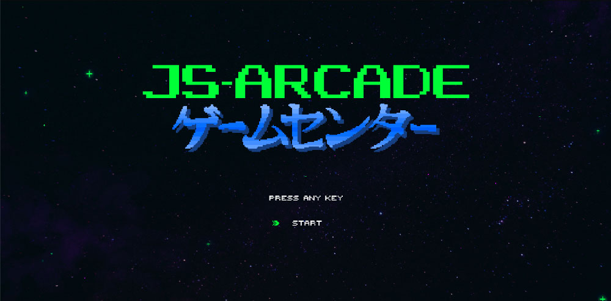

# JS-Arcade

Experimental browser games using only client-side JavaScript. Demo [here](https://justinh5.github.io/jsArcade/).

## Getting Started

Open in your [desktop browser](https://justinh5.github.io/jsArcade/). Not intended for mobile devices! Some games require key presses.

There are 4 games:
* Draughts - Checkers
* Starship - Alien blaster
* The Crypt - Random ternary memorization game
* Labyrinth - Choose your own difficulty maze game

## Testing

Only tested in Firefox and Chrome.

## Contributing

Please make a pull request for any enhancements, updating the README file if necessary.

## Authors

Created by Justin Haupt - Initial work

## License

This project is licensed under the MIT License. Content is licensed under CC-BY-SA-4.0. See the license for details
